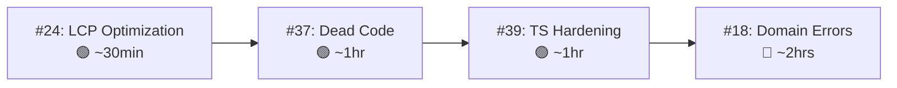

# NEIIST Website — Batch 2 Plan
**Date**: 2026-08-11 | **Current State**: v1.14.2 + 17 completed tasks

---

## 📊 Current Board State

### ✅ Done (17 items)
All previous work plus Batch 1 (#613 Toast, #637 Orders Table, #667 Login Redirect)

### 📋 Remaining Open Issues

**Fork issues (from original plan):**
| # | Task | Epic | Complexity | Can do autonomously? |
|---|------|------|------------|---------------------|
| #18 | Domain Error Mapping | Backend Security | 🟡 Medium | ✅ Yes |
| #20 | Database Pagination | Search & Filtering | 🔴 High | ⚠️ Needs DB schema review |
| #21 | Optimized Search | Search & Filtering | 🟡 Medium | ⚠️ Needs DB changes |
| #23 | Declarative Data Fetching | Performance | 🔴 High | ⚠️ Needs dependency install |
| #24 | LCP Optimization | Performance | 🟢 Low | ✅ Yes |
| #26 | Order Retroactive Linking | Edge Cases | 🟡 Medium | ⚠️ Needs DB function |
| #28 | Split God Object Repository | Edge Cases | 🔴 High | ✅ Yes (but risky) |
| #35 | Refactor Inline Styles | Maintainability | 🟡 Medium | ✅ Yes |
| #36 | i18n & Dynamic Text Prep | Maintainability | 🔴 High | ✅ Yes |
| #37 | Dead Code Elimination | Maintainability | 🟢 Low | ✅ Yes |
| #39 | TypeScript Definition Hardening | Infrastructure | 🟢 Low | ✅ Yes |
| #41 | Dependency Auditing | Infrastructure | 🟢 Low | ⚠️ Needs dependency changes |
| #7/#8 | External Users + Dup Members | Wave 3 | 🔴 High | ⚠️ Needs DB schema |

**Upstream-only issues (not on fork):**
| # | Task | Complexity | Autonomous? |
|---|------|------------|-------------|
| #679 | Calendar & Notion Sync Refactor | 🟡 Medium | ✅ Yes |
| #652 | GDPR User Data Deletion | 🟡 Medium | ⚠️ Needs DB function |
| #644 | Universal Search Component | 🔴 High | ⚠️ Needs dependency |
| #608 | Interactive Homepage Terminal | 🔴 High | ✅ Yes |
| #596 | Dedicated Image Server | 🔴 High | ⚠️ Needs infra |
| #460 | Blog Page | 🔴 High | ✅ Yes |

---

## 🎯 Batch 2: Selected Tasks

> [!IMPORTANT]
> Prioritizing tasks that are **safe to execute autonomously** (no secrets, no DB schema changes, no dependency installs) and deliver the highest impact.

### Task 1: 🔴 #18 — Domain Error Mapping
**Impact**: Backend reliability — stops brittle string-matching of PostgreSQL errors  
**Effort**: ~2 hours | **Files**: API routes + new error classes

**Plan:**
1. Create `src/lib/errors/` with typed domain errors: `NotFoundError`, `ConflictError`, `ValidationError`, `ForbiddenError`
2. Create error-handling middleware utility for API routes
3. Refactor API routes to catch PostgreSQL `err.code` (e.g., `23505` for unique violation) instead of `.includes("Insufficient")`
4. Map domain errors to proper HTTP status codes (404, 409, 400, 403)

### Task 2: 🟢 #24 — LCP Optimization  
**Impact**: Core Web Vitals — directly affects SEO and user perception  
**Effort**: ~30 min | **Files**: Homepage, About Us heroes

**Plan:**
1. Add `priority` prop to above-the-fold `<Image>` tags in Homepage Hero and About Us Hero
2. Audit and fix the `keydown` event listener on Homepage that reads `.offsetWidth` synchronously (causes layout thrashing)
3. Check for any large unoptimized images

### Task 3: 🟢 #37 — Dead Code Elimination
**Impact**: Maintainability — smaller bundle, cleaner codebase  
**Effort**: ~1 hour | **Files**: Various

**Plan:**
1. Use `ts-prune` or manual analysis to find unused exports
2. Remove legacy Python scripts from root (`fix_istid.py`, `refactor_api_routes.py`, `refactor_schema.py`)
3. Check for unused CSS classes
4. Audit NeiistLogo.tsx (19.8KB inline SVG → move to static asset?)

### Task 4: 🟢 #39 — TypeScript Definition Hardening
**Impact**: Developer experience — catches bugs at compile time  
**Effort**: ~1 hour | **Files**: `src/types/`, `src/utils/`

**Plan:**
1. Replace `unknown` types in SumUp API definitions with proper typed interfaces
2. Rename `dbUser` convention to `DbUser` (PascalCase for types)
3. Strictify optional properties where data is always present
4. Ensure all mapper functions have explicit return types

---

## 🔧 Execution Strategy

All 4 tasks run in **parallel** since they touch different files:
- #24 touches hero components only
- #37 touches dead code/assets
- #39 touches type definitions  
- #18 touches API routes and error handling

**Shall I proceed with this batch?**
