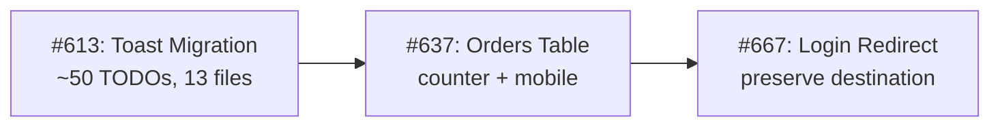

# NEIIST Website — Project Status & Next Steps
**Date**: 2026-08-10 | **Current Version**: v1.14.2 | **Branch**: `main` (clean)

---

## ✅ What's Done (Merged to `main`)

From our comprehensive plan, the following have been **completed and merged**:

| # | Task | PR/Commit | Epic |
|---|------|-----------|------|
| 1 | Google OAuth Flow & UI | [#63](file:///Users/tomasbrito/Documents/NEIIST/Site/neiist-website), [#62](file:///Users/tomasbrito/Documents/NEIIST/Site/neiist-website) | Epic 1: Google OAuth |
| 2 | Restrict Google Auth for IST students | `269534b` | Epic 1.2 |
| 3 | Refactor `neiist.add_user` stored proc | [#58](file:///Users/tomasbrito/Documents/NEIIST/Site/neiist-website) | Epic 1.3 |
| 4 | Headless Modals & Dialog primitive | [#64](file:///Users/tomasbrito/Documents/NEIIST/Site/neiist-website) | Epic 2.1 |
| 5 | Reusable Form Inputs (Input, Select, Button) | [#65](file:///Users/tomasbrito/Documents/NEIIST/Site/neiist-website) | Epic 2.2 |
| 6 | Strict Schema Validation (Zod) | [#66](file:///Users/tomasbrito/Documents/NEIIST/Site/neiist-website) | Epic 3.1 |
| 7 | Error Boundaries | [#57](file:///Users/tomasbrito/Documents/NEIIST/Site/neiist-website) | N/A |
| 8 | Calendar Fenix Fix (remove access_token check) | [#59](file:///Users/tomasbrito/Documents/NEIIST/Site/neiist-website) | Epic 6.2 |
| 9 | Add Missing Database Indexes | [#60](file:///Users/tomasbrito/Documents/NEIIST/Site/neiist-website) | Epic 6.4 |
| 10 | A11y Fixes for Shop components | [#61](file:///Users/tomasbrito/Documents/NEIIST/Site/neiist-website) | N/A |
| 11 | API Authentication Enforcement | [#54](file:///Users/tomasbrito/Documents/NEIIST/Site/neiist-website) | N/A |
| 12 | Docker Security & Reliability | [#53](file:///Users/tomasbrito/Documents/NEIIST/Site/neiist-website) | N/A |
| 13 | Backend Optimizations | [#56](file:///Users/tomasbrito/Documents/NEIIST/Site/neiist-website) | N/A |
| 14 | Google Auth base64url JWT fix | `e732038` | Bug fix |

## 🟢 Current Codebase Health
- **TypeScript**: ✅ Zero errors (`yarn type:check`)
- **ESLint**: ✅ Zero errors (`yarn lint`)
- **Working tree**: ✅ Clean (no uncommitted changes)

---

## 📋 Open Issues — Upstream (`neiist-dev/neiist-website`)

| # | Issue | Labels | Priority |
|---|-------|--------|----------|
| [#613](https://github.com/neiist-dev/neiist-website/issues/613) | Toast Notifications for all errors and status | frontend, tech debt, medium | 🔴 High |
| [#667](https://github.com/neiist-dev/neiist-website/issues/667) | Redirect after login ignores original destination | backend, medium | 🔴 High |
| [#637](https://github.com/neiist-dev/neiist-website/issues/637) | Orders Table: bottom counter, mobile readability | frontend, good first issue, medium | 🟡 Medium |
| [#679](https://github.com/neiist-dev/neiist-website/issues/679) | Refactor Calendar and Notion Sync | backend, performance, medium | 🟡 Medium |
| [#652](https://github.com/neiist-dev/neiist-website/issues/652) | Remove User Personal Data (GDPR) | — | 🟡 Medium |
| [#647](https://github.com/neiist-dev/neiist-website/issues/647) | Multi-Language Support (PT + EN) | frontend, backend, high | 🟡 Medium |
| [#644](https://github.com/neiist-dev/neiist-website/issues/644) | Universal Search Component | frontend, backend, high | 🟡 Medium |
| [#608](https://github.com/neiist-dev/neiist-website/issues/608) | Interactive Homepage with Terminal | frontend, backend, medium | 🟠 Lower |
| [#596](https://github.com/neiist-dev/neiist-website/issues/596) | Dedicated Image Server | backend, performance, medium | 🟠 Lower |
| [#460](https://github.com/neiist-dev/neiist-website/issues/460) | Blog Page | high | 🟠 Lower |
| [#609](https://github.com/neiist-dev/neiist-website/issues/609) | Recruitment Automation + Email Templates | — | 🟠 Lower |

**Open PRs (upstream)**:
- `#680` — release 2.0.0 (pending)
- `#678` — fix/redirect after login
- `#661` — i18n cookie-based (en, pt) — relates to #647
- `#654` — Delete user — relates to #652
- `#617` — New Homepage Hero with Terminal — relates to #608

## 📋 Open Issues — Fork (`tomasmbrito/neiist-website`)

From our original plan, these remain **open**:

| # | Issue | Epic | Status |
|---|-------|------|--------|
| #18 | Domain Error Mapping | Epic 3.2 | ❌ Not started |
| #20 | Database Pagination | Epic 4.1 | ❌ Not started |
| #21 | Optimized Search | Epic 4.2 | ❌ Not started |
| #23 | Declarative Data Fetching (useSWR/react-query) | Epic 5.1 | ❌ Not started |
| #24 | LCP Optimization | Epic 5.2 | ❌ Not started |
| #26 | Order Retroactive Linking | Epic 6.1 | ❌ Not started |
| #28 | Split "God Object" Repository | Epic 6.3 | ❌ Not started |
| #35 | Refactor Inline Styles | Maintainability | ❌ Not started |
| #36 | i18n & Dynamic Text Preparation | Maintainability | ❌ Not started |
| #37 | Dead Code Elimination | Maintainability | ❌ Not started |
| #39 | TypeScript Definition Hardening | Infrastructure | ❌ Not started |
| #41 | Dependency Auditing | Infrastructure | ❌ Not started |
| #7/#8 | External User Support + Duplicate Members Bug | Wave 3 | ❌ Not started |
| #46-#52 | Digital Ticketing, Job Board, Testing | Future Epics | ❌ Not started |

---

## 🎯 Recommended Next Tasks (Priority Order)

### Batch 1: High-Impact, Safe to Proceed Autonomously

> [!IMPORTANT]
> These tasks are **pure application code changes** — no secrets, no schema changes, no deploys needed.

1. **🔴 #613 — Toast Notifications Migration** (~50 TODOs across 13 components)
   - Replace inline error messages with Sonner toasts
   - Largest single tech debt item in the codebase
   - **Impact**: Better UX across the entire app

2. **🔴 #667 — Redirect After Login** (fix user flow)
   - Users lose their navigation context after login
   - PR #678 already exists upstream — need to check its state and either continue or build fresh
   - **Impact**: Critical UX bug

3. **🟡 #637 — Orders Table Improvements** (bottom counter + mobile)
   - Good first issue, well-scoped
   - **Impact**: Admin UX improvement

### Batch 2: Medium Complexity

4. **#18 — Domain Error Mapping** (backend quality)
5. **#24 — LCP Optimization** (performance)
6. **#37 — Dead Code Elimination** (housekeeping)

---

## 🔧 Proposed Execution Plan

I recommend starting with **Batch 1** tasks. Here's the order:

**Shall I proceed with this plan?**
